# Sơ Đồ Tổng Quan Kiến Trúc Hệ Thống

## Mô Hình Tổng Quan

```mermaid
graph LR
    subgraph Clients[Lớp Client]
        Web[Web Browser]
        Mobile[Mobile App]
        API[External APIs]
    end
    
    subgraph Gateway[API Gateway]
        GW[Express Server<br/>Port 3000]
        Auth[Authentication]
    end
    
    subgraph Services[Lớp Dịch Vụ]
        S1[Device Service<br/>Xử lý thiết bị & vị trí]
        S2[User Service<br/>Quản lý người dùng]
        S3[Map Service<br/>Bản đồ & lịch sử]
        S4[Report Service<br/>Báo cáo & thống kê]
        S5[Monitoring<br/>Giám sát hệ thống]
    end
    
    subgraph Queue[Message Queue]
        WS[WebSocket<br/>Real-time]
        MQ[Event Bus<br/>Future]
    end
    
    subgraph Data[Lớp Dữ Liệu]
        DB[(MS SQL Server<br/>Database)]
        FS[File Storage<br/>Templates & Reports]
        Cache[Redis Cache<br/>Future]
    end
    
    Clients --> Gateway
    Gateway --> Services
    Services --> Queue
    Services --> Data
    Queue -.Real-time.-> Clients
    
    classDef clientClass fill:#e3f2fd,stroke:#1976d2
    classDef gatewayClass fill:#fff3e0,stroke:#f57c00
    classDef serviceClass fill:#f3e5f5,stroke:#7b1fa2
    classDef queueClass fill:#e8f5e9,stroke:#388e3c
    classDef dataClass fill:#fce4ec,stroke:#c2185b
    
    class Clients,Web,Mobile,API clientClass
    class Gateway,GW,Auth gatewayClass
    class Services,S1,S2,S3,S4,S5 serviceClass
    class Queue,WS,MQ queueClass
    class Data,DB,FS,Cache dataClass
```



## Các Thành Phần Chính

### 1️⃣ API Gateway
- **Mục đích:** Điểm vào duy nhất cho tất cả requests
- **Công nghệ:** Express.js (Node.js)
- **Port:** 3000
- **Chức năng:** 
  - Routing requests
  - Authentication & Authorization
  - CORS, Rate limiting

### 2️⃣ Service Xử Lý Dữ Liệu Thiết Bị
- **Trạng thái:** ✅ Đã triển khai
- **Chức năng:**
  - Nhận dữ liệu GPS từ thiết bị
  - Quản lý thông tin tàu
  - Real-time location updates
  - Xử lý dữ liệu loài cá & cảng

### 3️⃣ Service Quản Lý Người Dùng & Phân Quyền
- **Trạng thái:** 🔄 Đang phát triển
- **Chức năng:**
  - Quản lý tài khoản người dùng
  - Xác thực đăng nhập
  - Phân quyền theo vai trò (RBAC)
  - Quản lý session

### 4️⃣ Service Xử Lý Bản Đồ & Lịch Sử Hành Trình
- **Trạng thái:** ✅ Frontend hoàn thiện, Backend đang phát triển
- **Chức năng:**
  - Hiển thị bản đồ (OpenLayers)
  - Lưu trữ lịch sử hành trình
  - Replay route (phát lại đường đi)
  - Xử lý dữ liệu địa lý VN

### 5️⃣ Service Báo Cáo & Thống Kê
- **Trạng thái:** ✅ Đã triển khai cơ bản
- **Chức năng:**
  - Tạo báo cáo DOCX/PDF
  - Export dữ liệu
  - Thống kê hoạt động
  - Analytics (đang phát triển)

### 6️⃣ Database & Storage
- **Database:** MS SQL Server
- **File Storage:** File system (templates, reports)
- **Future:** Redis cache cho performance

### 7️⃣ Message Queue
- **Hiện tại:** WebSocket cho real-time updates
- **Future:** Redis Pub/Sub hoặc RabbitMQ

### 8️⃣ Module Giám Sát & Logging
- **Trạng thái:** 🔮 Cần triển khai
- **Chức năng kế hoạch:**
  - Centralized logging
  - Health checks
  - Performance metrics
  - Alert system

---

## Luồng Dữ Liệu

### 📍 Tracking Vị Trí Real-time
```
Thiết bị GPS → API Gateway → Device Service → Database
                     ↓
               WebSocket → Client (cập nhật ngay lập tức)
```

### 👤 Đăng Nhập
```
Client → API Gateway → Auth Service → Database → JWT Token → Client
```

### 📊 Tạo Báo Cáo
```
Client → API Gateway → Report Service → Query Database
                            ↓
                     Generate Report (DOCX/PDF)
                            ↓
                       Save to Storage → Download Link
```

---

## Công Nghệ Sử Dụng

| Component | Technology |
|-----------|-----------|
| **Backend** | Node.js + Express.js |
| **Database** | MS SQL Server |
| **Frontend** | Vanilla JS + OpenLayers |
| **UI Framework** | Bootstrap 5 + Tailwind CSS |
| **Real-time** | WebSocket (ws) |
| **Report Gen** | Puppeteer + LibreOffice |
| **Deployment** | Windows Server 2019 + IIS |

---

## Trạng Thái Triển Khai

| Service | Status | Priority |
|---------|--------|----------|
| API Gateway | ✅ Done | - |
| Device Service | ✅ Done | - |
| Map Service (Frontend) | ✅ Done | - |
| Map Service (Backend) | 🔄 In Progress | High |
| Report Service | ✅ Basic | Medium |
| User Service | 🔄 Minimal | High |
| Monitoring | 🔮 Planned | Medium |
| Message Queue | 🔄 WebSocket only | Low |
| Cache Layer | 🔮 Planned | Low |

**Legend:**
- ✅ Done: Đã hoàn thành
- 🔄 In Progress: Đang phát triển
- 🔮 Planned: Kế hoạch tương lai

---

## Next Steps

### Ưu tiên cao
1. Hoàn thiện User Management & RBAC system
2. Tăng cường Map Service backend APIs
3. Implement monitoring & logging

### Ưu tiên trung bình
4. Advanced analytics & statistics
5. Report scheduling & automation
6. Performance optimization với caching

### Ưu tiên thấp
7. Message queue migration (Redis/RabbitMQ)
8. Microservices separation
9. Mobile app development

---

**Chi tiết đầy đủ:** Xem [SYSTEM_ARCHITECTURE.md](./SYSTEM_ARCHITECTURE.md)
