# Sơ Đồ Luồng Dữ Liệu (Data Flow Diagrams)

Tài liệu này mô tả các luồng dữ liệu chính trong hệ thống quản lý tàu biển.

---

## 1. Luồng Tracking Vị Trí Real-time

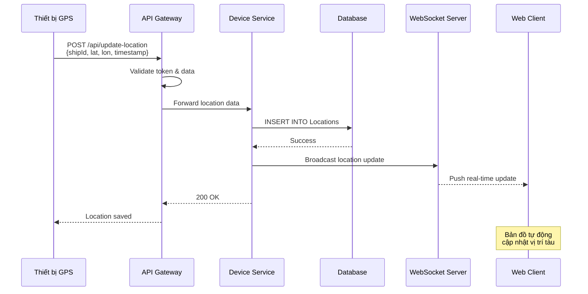

---

## 2. Luồng Đăng Nhập & Xác Thực

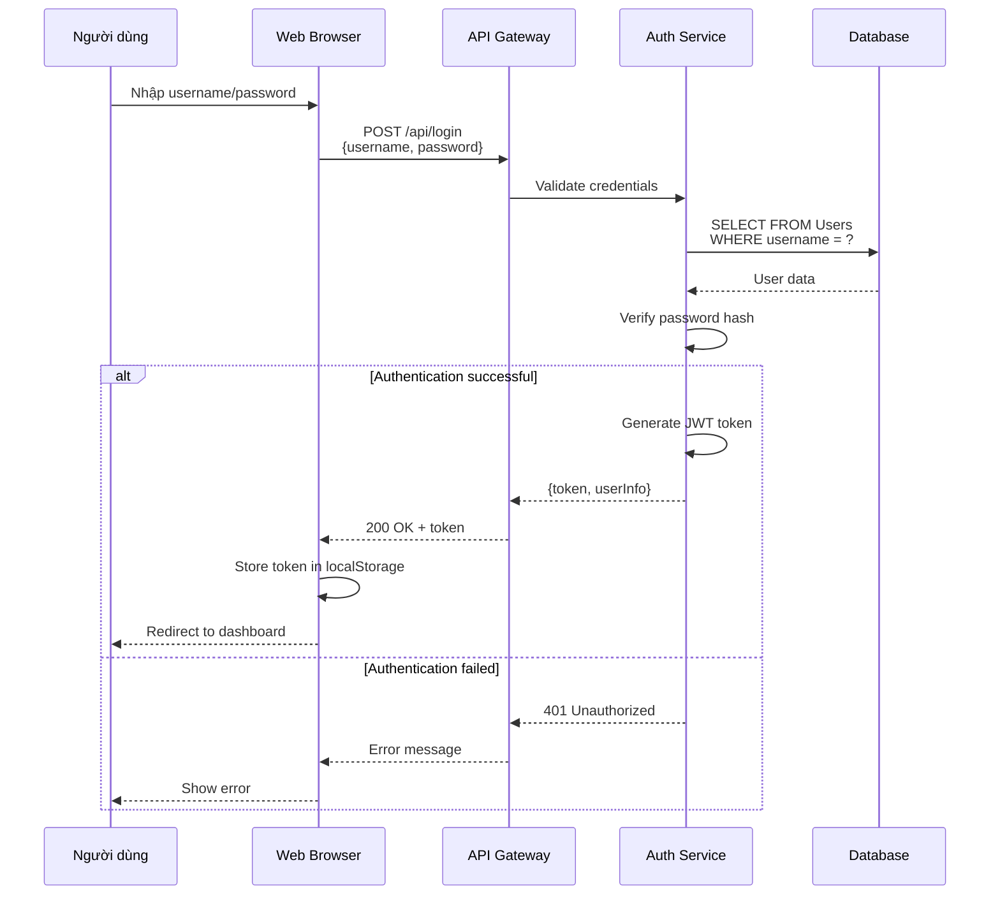

---

## 3. Luồng Tạo Báo Cáo Chuyến Biển

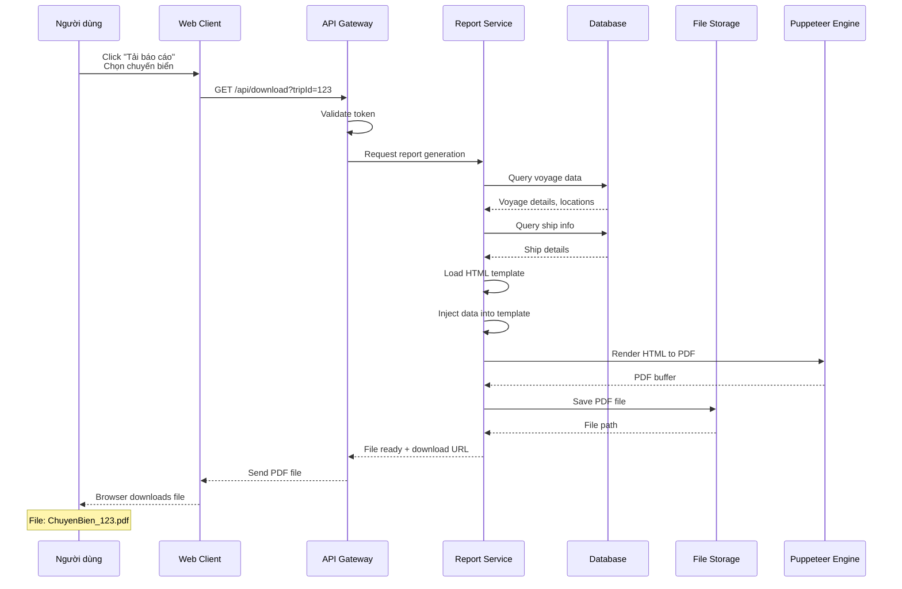

---

## 4. Luồng Hiển Thị Bản Đồ & Lịch Sử Hành Trình

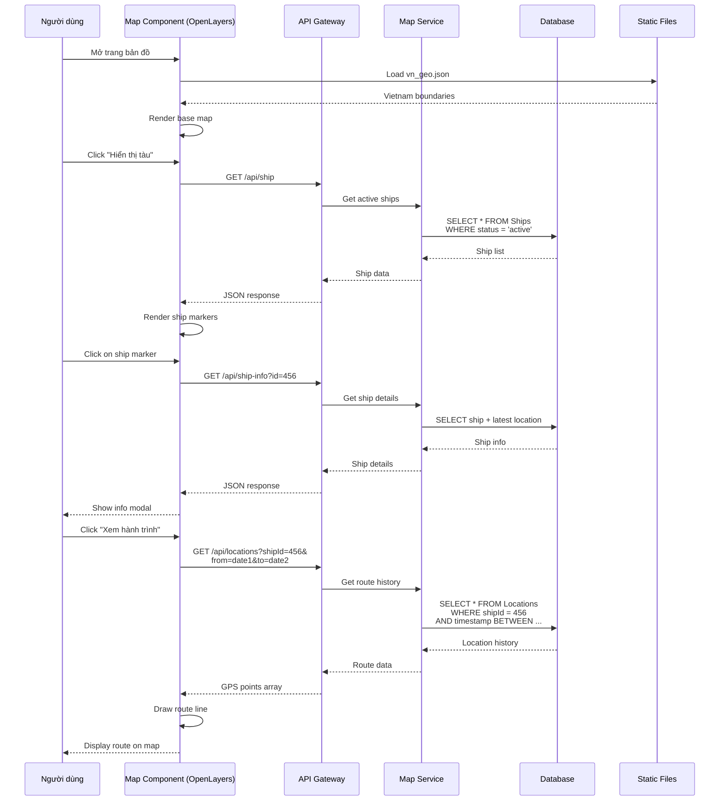

---

## 5. Luồng Thêm Tàu Mới

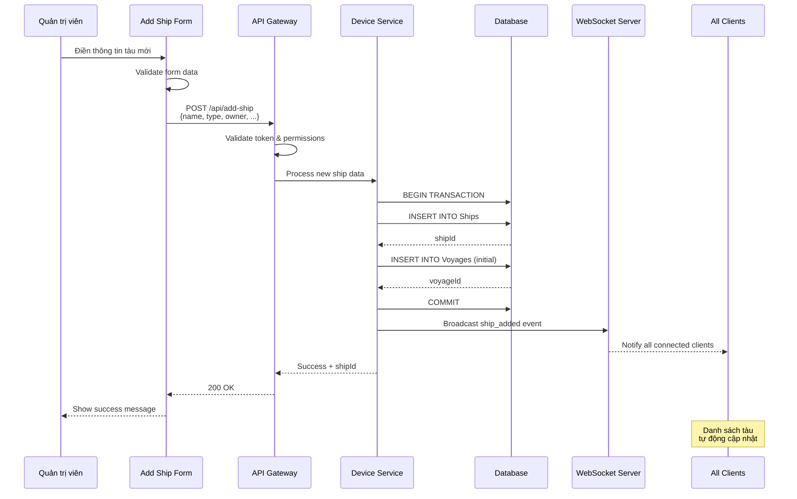

---

## 6. Luồng WebSocket Real-time Updates

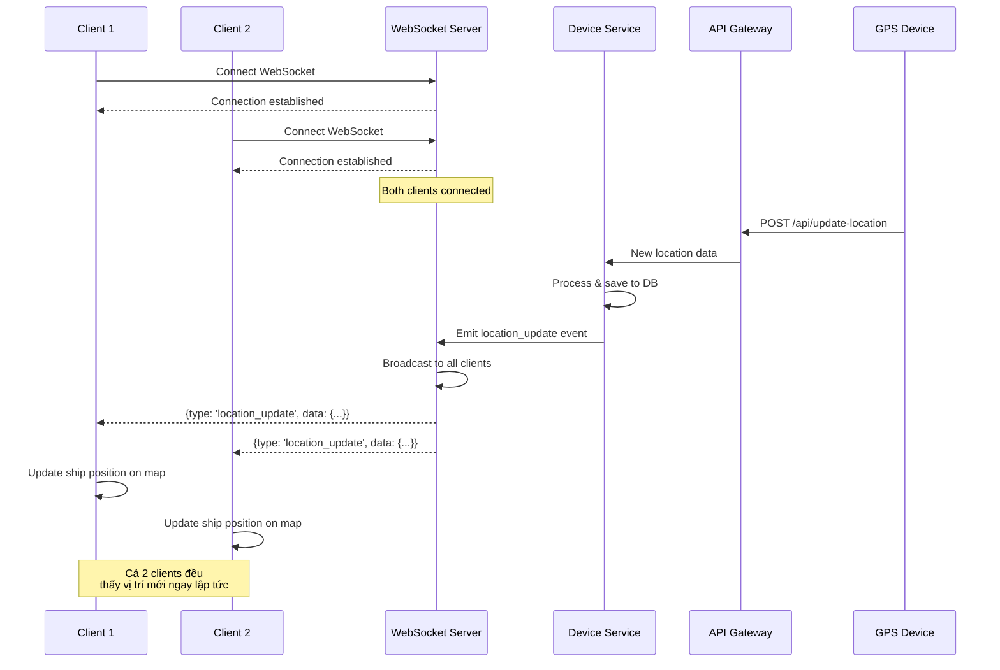

---

## 7. Luồng Tìm Kiếm & Lọc Tàu

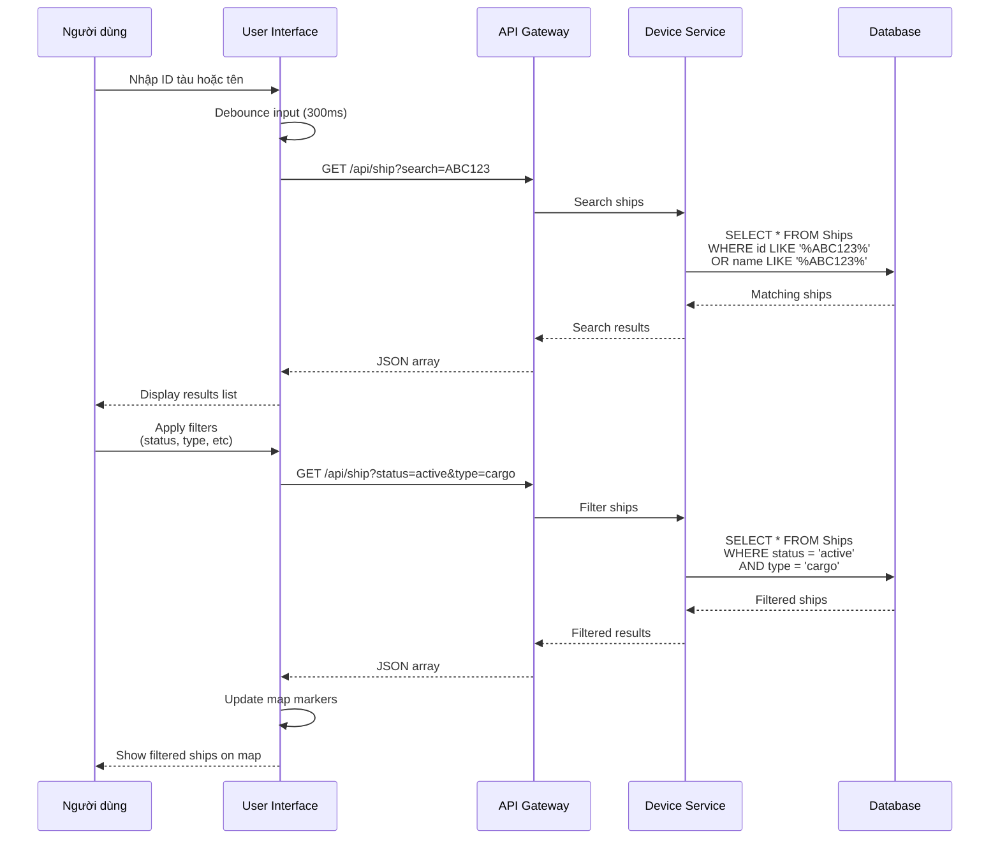

---

## 8. Luồng Xử Lý Lỗi & Retry

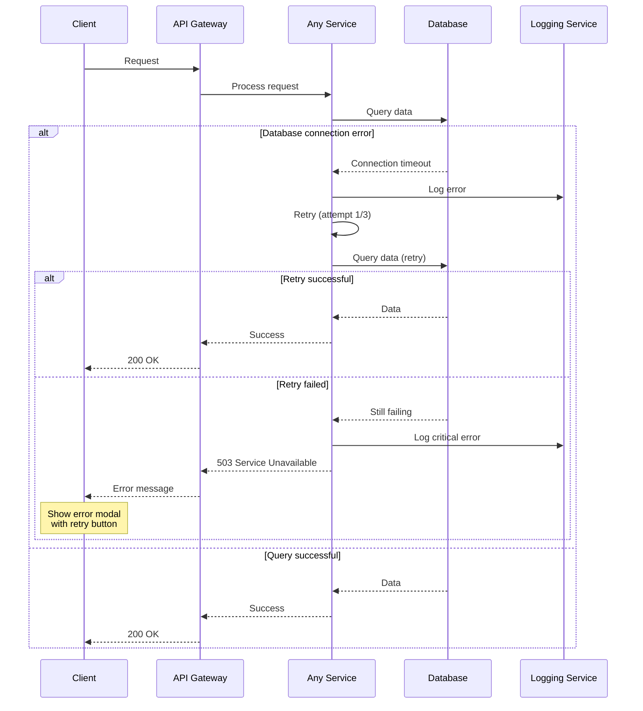

---

## 9. Luồng Scheduled Tasks (Future)

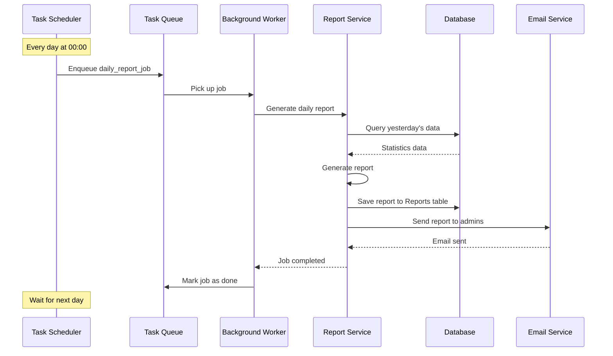

---

## 10. Architecture Data Flow Summary

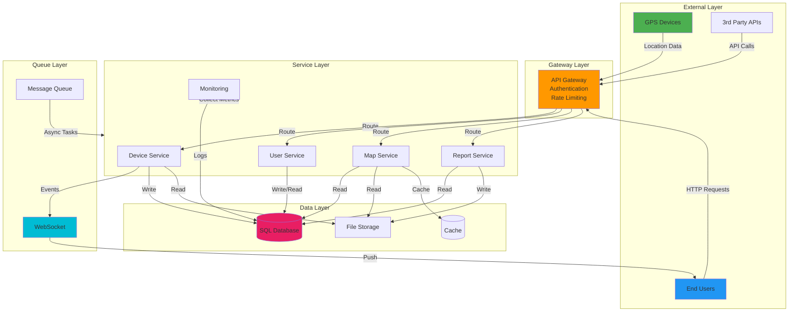

---

## Các Trường Hợp Đặc Biệt

### Emergency/SOS Handling
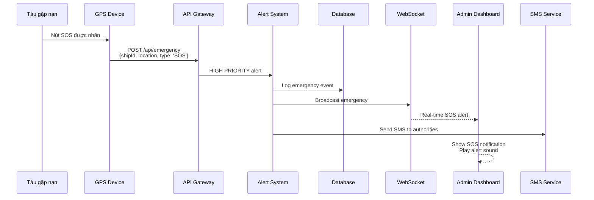

### System Health Check
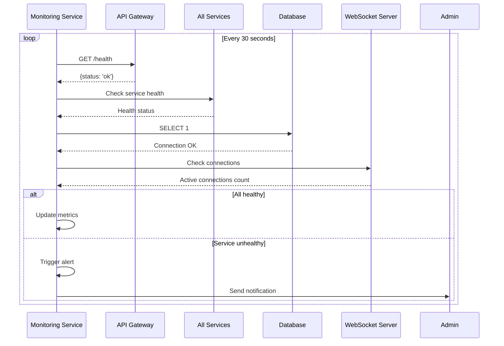

---

**Tài liệu liên quan:**
- [Tổng quan kiến trúc](./ARCHITECTURE_OVERVIEW.md)
- [Chi tiết kiến trúc](./SYSTEM_ARCHITECTURE.md)
