# Sơ Đồ Kiến Trúc Hệ Thống - Hệ Thống Quản Lý Tàu Biển

## Tổng Quan

Tài liệu này mô tả kiến trúc tổng thể của hệ thống quản lý và giám sát tàu biển, bao gồm các thành phần chính, luồng dữ liệu và tương tác giữa các dịch vụ.

---

## Sơ Đồ Kiến Trúc Tổng Thể

```mermaid
graph TB
    %% External Clients
    Client[Web Client<br/>Trình duyệt]
    MobileApp[Mobile App<br/>Ứng dụng di động]
    ThirdParty[Third Party Systems<br/>Hệ thống bên ngoài]
    
    %% API Gateway Layer
    subgraph API_Gateway[API Gateway Layer]
        Gateway[API Gateway<br/>Express.js Server<br/>Port 3000]
        Auth[Authentication & Authorization<br/>JWT/Token Based]
        RateLimit[Rate Limiting & Throttling]
        CORS[CORS Configuration]
    end
    
    %% Service Layer
    subgraph Services[Service Layer - Microservices]
        
        subgraph DeviceService[Device Data Processing Service]
            LocationTracker[Location Tracker<br/>GPS Data Processing]
            DeviceManager[Device Manager<br/>Ship Registration]
            RealtimeUpdater[Real-time Updater<br/>WebSocket Handler]
        end
        
        subgraph UserService[User Management & Authorization Service]
            UserMgmt[User Management<br/>CRUD Operations]
            RoleMgmt[Role & Permission<br/>RBAC System]
            SessionMgmt[Session Management<br/>Token Validation]
        end
        
        subgraph MapService[Map & Route History Service]
            MapRenderer[Map Data Service<br/>Tile Server Integration]
            RouteHistory[Route History<br/>Track & Replay]
            GeoService[Geo-processing<br/>VN Boundaries & Zones]
        end
        
        subgraph ReportService[Report & Statistics Service]
            ReportGen[Report Generator<br/>DOCX/PDF Export]
            Analytics[Analytics Engine<br/>Data Aggregation]
            Statistics[Statistics Service<br/>Dashboard Metrics]
        end
        
        subgraph MonitorService[Monitoring & Logging Module]
            Logger[Centralized Logger<br/>Winston/Bunyan]
            HealthCheck[Health Check Service<br/>System Status]
            Metrics[Metrics Collector<br/>Performance Monitoring]
            AlertSystem[Alert System<br/>Anomaly Detection]
        end
        
    end
    
    %% Message Queue Layer
    subgraph MessageQueue[Message Queue Layer]
        WebSocketServer[WebSocket Server<br/>Real-time Communication<br/>ws://]
        EventBus[Event Bus<br/>Future: Redis Pub/Sub]
        TaskQueue[Task Queue<br/>Future: Bull/RabbitMQ]
    end
    
    %% Data Layer
    subgraph DataLayer[Data & Storage Layer]
        
        subgraph Database[Database - MS SQL Server]
            ShipDB[(Ship Database<br/>Ship Information)]
            VoyageDB[(Voyage Database<br/>Trip Records)]
            LocationDB[(Location Database<br/>GPS Tracking Data)]
            UserDB[(User Database<br/>Authentication & Roles)]
            ReportDB[(Report Database<br/>Generated Reports)]
        end
        
        subgraph Storage[File Storage]
            FileStorage[File System<br/>Templates & Generated Files]
            StaticAssets[Static Assets<br/>Maps, Icons, UI Resources]
            Cache[Cache Layer<br/>Future: Redis Cache]
        end
        
        subgraph ExternalData[External Data Sources]
            SpeciesData[Species Data<br/>species.json]
            PortData[Port Data<br/>cang.json]
            GeoData[Geographic Data<br/>vn_geo.json]
        end
        
    end
    
    %% Connections from Clients
    Client --> Gateway
    MobileApp --> Gateway
    ThirdParty --> Gateway
    
    %% API Gateway to Auth
    Gateway --> Auth
    Gateway --> RateLimit
    Gateway --> CORS
    
    %% API Gateway to Services
    Auth --> DeviceService
    Auth --> UserService
    Auth --> MapService
    Auth --> ReportService
    
    %% Services to Message Queue
    DeviceService --> WebSocketServer
    LocationTracker --> EventBus
    RealtimeUpdater --> WebSocketServer
    
    %% Services to Database
    DeviceService --> ShipDB
    DeviceService --> LocationDB
    DeviceService --> VoyageDB
    
    UserService --> UserDB
    
    MapService --> LocationDB
    MapService --> VoyageDB
    MapService --> GeoData
    
    ReportService --> ReportDB
    ReportService --> VoyageDB
    ReportService --> ShipDB
    ReportService --> FileStorage
    
    %% Monitoring
    Gateway --> MonitorService
    DeviceService --> MonitorService
    UserService --> MonitorService
    MapService --> MonitorService
    ReportService --> MonitorService
    
    MonitorService --> Database
    MonitorService --> Storage
    
    %% Message Queue to Clients
    WebSocketServer -.Real-time Updates.-> Client
    WebSocketServer -.Real-time Updates.-> MobileApp
    
    %% Storage connections
    MapService --> StaticAssets
    DeviceService --> SpeciesData
    DeviceService --> PortData
    
    %% Future connections (dotted lines)
    TaskQueue -.Future: Async Tasks.-> ReportService
    EventBus -.Future: Event-driven.-> Analytics
    Cache -.Future: Caching.-> MapService
    Cache -.Future: Caching.-> DeviceService
    
    %% Styling
    classDef clientStyle fill:#e1f5ff,stroke:#0288d1,stroke-width:2px
    classDef gatewayStyle fill:#fff3e0,stroke:#f57c00,stroke-width:2px
    classDef serviceStyle fill:#f3e5f5,stroke:#7b1fa2,stroke-width:2px
    classDef queueStyle fill:#e8f5e9,stroke:#388e3c,stroke-width:2px
    classDef dataStyle fill:#fce4ec,stroke:#c2185b,stroke-width:2px
    classDef monitorStyle fill:#fff9c4,stroke:#f9a825,stroke-width:2px
    
    class Client,MobileApp,ThirdParty clientStyle
    class Gateway,Auth,RateLimit,CORS gatewayStyle
    class DeviceService,UserService,MapService,ReportService serviceStyle
    class MonitorService monitorStyle
    class WebSocketServer,EventBus,TaskQueue queueStyle
    class Database,Storage,ExternalData,ShipDB,VoyageDB,LocationDB,UserDB,ReportDB,FileStorage,StaticAssets,Cache,SpeciesData,PortData,GeoData dataStyle
```



---

## Chi Tiết Các Thành Phần

### 1. API Gateway Layer

**Chức năng chính:**
- Điểm vào duy nhất cho tất cả requests từ clients
- Xác thực và phân quyền người dùng
- Rate limiting và throttling để bảo vệ hệ thống
- CORS configuration cho web clients
- Request routing đến các services phù hợp

**Công nghệ:**
- Express.js (Node.js framework)
- Middleware: cors, express.json
- Port: 3000 (configurable)

**Endpoints chính:**
```
GET  /api/ship              - Lấy danh sách tàu
GET  /api/chuyen-bien       - Lấy danh sách chuyến biển
GET  /api/locations         - Lấy vị trí tàu
GET  /api/ship-info         - Thông tin chi tiết tàu
POST /api/add-ship          - Thêm tàu mới
GET  /api/thong-tin-chuyen-bien - Chi tiết chuyến biển
GET  /api/download          - Tải báo cáo
GET  /api/login             - Đăng nhập
```

---

### 2. Service Layer

#### 2.1 Device Data Processing Service
**Trạng thái:** ✅ Đã triển khai

**Chức năng:**
- Xử lý dữ liệu GPS từ thiết bị tracking trên tàu
- Quản lý thông tin tàu (đăng ký, cập nhật, xóa)
- Real-time location updates qua WebSocket
- Xử lý dữ liệu loài cá và cảng biển

**Components:**
- `LocationTracker`: Nhận và xử lý dữ liệu GPS
- `DeviceManager`: CRUD operations cho thiết bị/tàu
- `RealtimeUpdater`: Push updates qua WebSocket

**Database tables:**
- Ships (thông tin tàu)
- Locations (dữ liệu GPS tracking)
- Voyages (chuyến biển)

#### 2.2 User Management & Authorization Service
**Trạng thái:** 🔄 Đang phát triển

**Chức năng:**
- Quản lý người dùng (tạo, sửa, xóa tài khoản)
- Xác thực đăng nhập (authentication)
- Phân quyền dựa trên vai trò (RBAC - Role-Based Access Control)
- Quản lý session và tokens

**Components hiện tại:**
- Basic login endpoint (`/api/login`)
- Token-based authentication (localStorage)

**Cần phát triển:**
- [ ] User CRUD endpoints
- [ ] Role management system
- [ ] Permission matrix
- [ ] JWT token refresh mechanism
- [ ] Password reset functionality
- [ ] Audit logging for user actions

**Database tables (cần tạo):**
- Users (thông tin người dùng)
- Roles (vai trò)
- Permissions (quyền hạn)
- UserRoles (mapping)
- Sessions (phiên đăng nhập)

#### 2.3 Map & Route History Service
**Trạng thái:** ✅ Đã triển khai (Frontend), 🔄 Backend đang phát triển

**Chức năng:**
- Cung cấp dữ liệu bản đồ (tile server integration)
- Lưu trữ và truy vấn lịch sử hành trình
- Replay route (phát lại hành trình)
- Xử lý dữ liệu địa lý (biên giới Việt Nam, vùng biển)

**Components:**
- Frontend: OpenLayers integration
- Backend: Location history queries
- Geo-processing: vn_geo.json boundaries

**Cần phát triển:**
- [ ] Route optimization algorithms
- [ ] Geofencing alerts
- [ ] Historical route analytics
- [ ] Map layer management API

#### 2.4 Report & Statistics Service
**Trạng thái:** ✅ Đã triển khai một phần

**Chức năng:**
- Tạo báo cáo chuyến biển (DOCX/PDF format)
- Thống kê hoạt động tàu
- Analytics dashboard data
- Export dữ liệu

**Components hiện tại:**
- Report generation: Puppeteer + LibreOffice
- Template-based reports (template.html, template.docx)
- Download endpoint

**Cần phát triển:**
- [ ] Advanced analytics (trends, patterns)
- [ ] Scheduled reports
- [ ] Dashboard metrics API
- [ ] Data visualization endpoints
- [ ] Export to multiple formats (Excel, CSV)

**Công nghệ:**
- Puppeteer (HTML to PDF)
- LibreOffice-convert (DOCX conversion)
- Docxtemplater (template processing)

#### 2.5 Monitoring & Logging Module
**Trạng thái:** 🔄 Cần triển khai

**Chức năng:**
- Centralized logging cho toàn bộ hệ thống
- Health check endpoints
- Performance metrics collection
- Alert system khi có sự cố
- Error tracking và reporting

**Cần triển khai:**
- [ ] Winston/Bunyan logger integration
- [ ] Health check endpoints (/health, /ready)
- [ ] Metrics collection (response time, error rates)
- [ ] Alert rules configuration
- [ ] Log aggregation and search
- [ ] Performance dashboards

**Khuyến nghị công nghệ:**
- Logging: Winston hoặc Bunyan
- Metrics: Prometheus + Grafana
- APM: New Relic hoặc Datadog (optional)

---

### 3. Message Queue Layer

#### 3.1 WebSocket Server
**Trạng thái:** ✅ Đã triển khai

**Chức năng:**
- Real-time communication với clients
- Push location updates ngay lập tức
- Broadcasting system events

**Implementation:**
- Sử dụng `ws` package
- Integrated trong app.js

#### 3.2 Event Bus (Future)
**Trạng thái:** 🔮 Kế hoạch tương lai

**Chức năng:**
- Event-driven architecture
- Decouple services
- Publish/Subscribe pattern

**Khuyến nghị:**
- Redis Pub/Sub cho đơn giản
- Apache Kafka cho scale lớn

#### 3.3 Task Queue (Future)
**Trạng thái:** 🔮 Kế hoạch tương lai

**Chức năng:**
- Async job processing
- Report generation queue
- Scheduled tasks

**Khuyến nghị:**
- Bull (Redis-based queue)
- RabbitMQ cho advanced features

---

### 4. Data & Storage Layer

#### 4.1 Database (MS SQL Server)
**Trạng thái:** ✅ Đã triển khai

**Cấu hình:**
- Host: Configurable via config.env
- Provider: mssql package
- Connection pooling enabled

**Main Tables:**
- Ships: Thông tin tàu biển
- Voyages: Chuyến biển
- Locations: GPS tracking data
- (Future) Users, Roles, Permissions
- (Future) Reports, Logs

**Schema location:** `./sql/` directory

#### 4.2 File Storage
**Trạng thái:** ✅ Đã triển khai

**Chức năng:**
- Lưu trữ templates (DOCX, HTML)
- Generated reports
- Static assets (maps, icons)

**Structure:**
```
/src/
  template.html
  template.docx
  output.css
/public/
  *.svg (icons)
/data/
  species.json
  cang.json
  vn_geo.json
```

#### 4.3 Cache Layer (Future)
**Trạng thái:** 🔮 Kế hoạch tương lai

**Chức năng:**
- Cache frequently accessed data
- Reduce database load
- Speed up map tile serving

**Khuyến nghị:**
- Redis cho in-memory caching
- Cache invalidation strategies

#### 4.4 External Data Sources
**Trạng thái:** ✅ Đã triển khai

**Files:**
- `species.json`: Danh sách loài cá
- `cang.json`: Danh sách cảng biển
- `vn_geo.json`: Dữ liệu địa lý Việt Nam

---

## Luồng Dữ Liệu Chính

### 1. Real-time Location Tracking
```
Device GPS → API Gateway → Device Service → Database (Locations)
                    ↓
            WebSocket Server → Connected Clients
```

### 2. User Authentication
```
Client → API Gateway → Auth Service → Database (Users) → JWT Token → Client
```

### 3. Report Generation
```
Client → API Gateway → Report Service → Database (query data)
                              ↓
                    Template + Data → PDF/DOCX → File Storage
                              ↓
                        Download URL → Client
```

### 4. Map & Route History
```
Client → API Gateway → Map Service → Database (Locations) → Route Data
                              ↓
                    Frontend (OpenLayers) → Render Map
```

---

## Bảo Mật

### Authentication & Authorization
- ✅ Token-based authentication (localStorage)
- 🔄 JWT implementation (cần cải thiện)
- 🔄 Role-based access control (cần triển khai)

### Network Security
- ✅ CORS configuration
- 🔄 Rate limiting (cần thêm)
- 🔄 Input validation (cần tăng cường)
- 🔄 SQL injection protection (sử dụng parameterized queries)

### Data Security
- 🔄 Encryption at rest (khuyến nghị)
- 🔄 Encryption in transit (HTTPS - cần triển khai production)
- 🔄 Database access control

---

## Scalability & Performance

### Current Limitations
- Single server deployment
- Synchronous processing
- Limited caching

### Recommendations for Scaling
1. **Horizontal Scaling:**
   - Load balancer trước API Gateway
   - Multiple service instances
   - Database read replicas

2. **Caching Strategy:**
   - Redis cho session storage
   - CDN cho static assets
   - Database query caching

3. **Async Processing:**
   - Message queue cho heavy tasks
   - Background workers
   - Scheduled jobs

4. **Database Optimization:**
   - Indexing strategy
   - Query optimization
   - Partitioning cho large tables (Locations)

---

## Triển Khai (Deployment)

### Current Setup
- Platform: Windows Server 2019 + IIS
- Runtime: Node.js + IISNode
- Reverse Proxy: IIS
- Config: web.config, ecosystem.config.js

### Production Checklist
- [ ] Environment variables configuration
- [ ] Database connection pooling
- [ ] Error handling & logging
- [ ] Health check endpoints
- [ ] Monitoring setup
- [ ] Backup & disaster recovery
- [ ] SSL/TLS certificates
- [ ] Load testing

---

## Roadmap & Phát Triển Tiếp Theo

### Phase 1: Core Services (Hiện tại)
- [x] API Gateway
- [x] Device Data Processing
- [x] Basic Map Service
- [x] Report Generation
- [x] WebSocket real-time updates

### Phase 2: User Management (3-6 tháng)
- [ ] Complete User CRUD
- [ ] Role & Permission system
- [ ] Advanced authentication (2FA)
- [ ] Audit logging

### Phase 3: Advanced Features (6-12 tháng)
- [ ] Analytics & Statistics dashboard
- [ ] Predictive analytics
- [ ] Advanced geofencing
- [ ] Mobile app integration
- [ ] Third-party API integrations

### Phase 4: Infrastructure (Liên tục)
- [ ] Monitoring & Logging system
- [ ] Message Queue implementation
- [ ] Caching layer
- [ ] Auto-scaling capabilities
- [ ] CI/CD pipeline

---

## Tài Liệu Tham Khảo

- **Code Repository:** `/map-sever/` và `/my-app/`
- **Deployment Guide:** `map-sever/DEPLOYMENT_GUIDE.md`
- **UI Design:** `my-app/docs/UI-Design-Report.md`
- **Database Schema:** `map-sever/sql/`

---

## Liên Hệ & Hỗ Trợ

Để biết thêm thông tin hoặc đóng góp vào dự án, vui lòng liên hệ team phát triển.

---

**Phiên bản:** 1.0  
**Ngày cập nhật:** 2025-11-19  
**Tác giả:** Development Team
