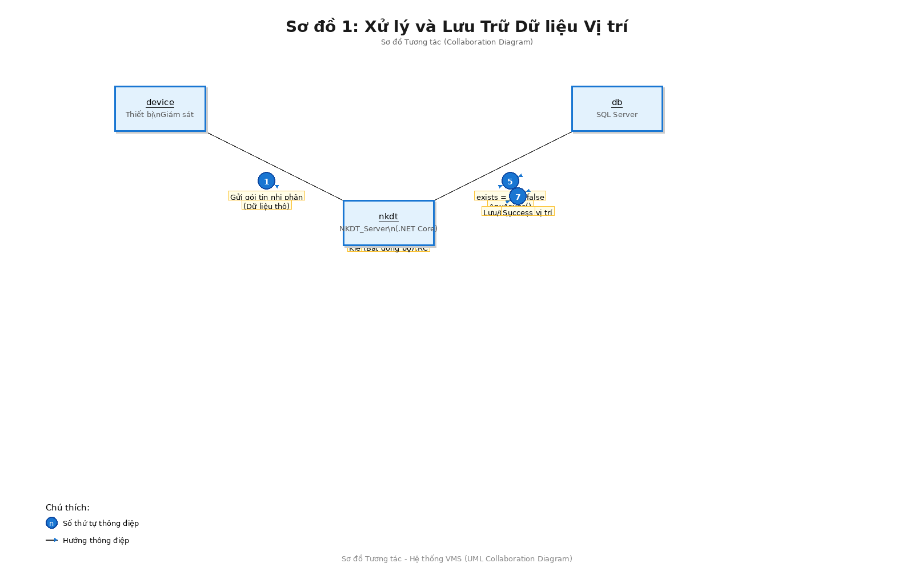
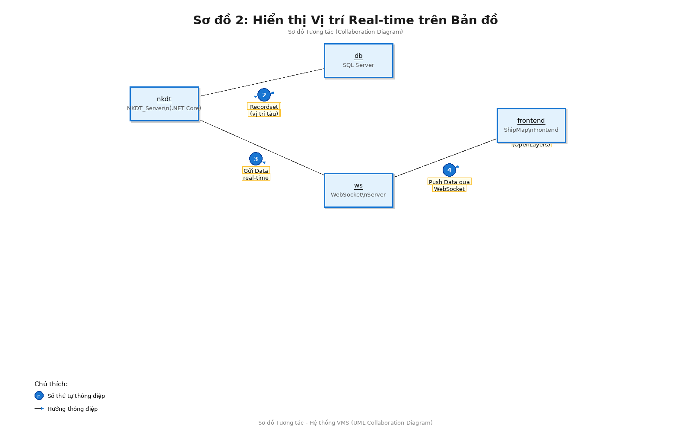
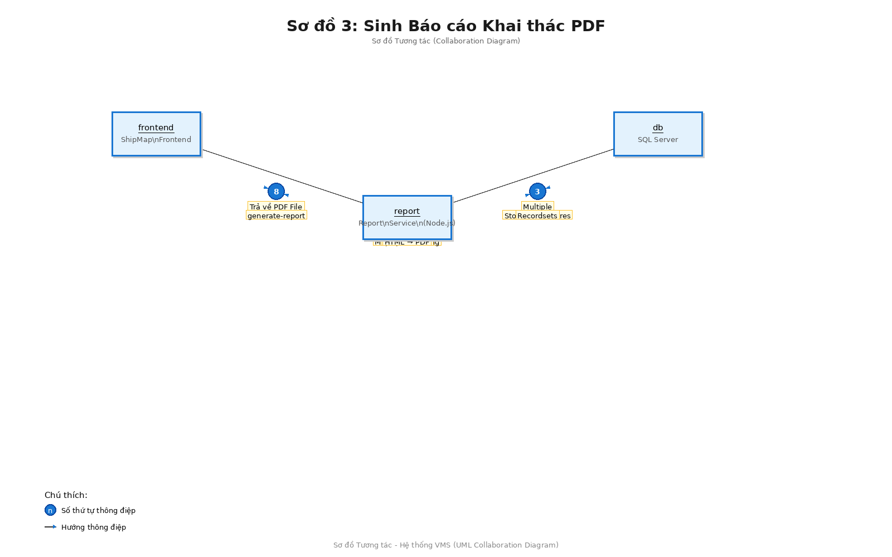

# Sơ đồ Tương tác Hệ thống VMS (Vessel Monitoring System)

**Ngày tạo**: 2025-11-18  
**Phiên bản**: 1.0  
**Loại sơ đồ**: Collaboration Diagram (Communication Diagram)

---

## Mục lục

1. [Giới thiệu](#giới-thiệu)
2. [Sơ đồ Tương tác 1: Xử lý và Lưu Trữ Dữ liệu Vị trí](#sơ-đồ-tương-tác-1-xử-lý-và-lưu-trữ-dữ-liệu-vị-trí)
3. [Sơ đồ Tương tác 2: Hiển thị Vị trí Real-time trên Bản đồ](#sơ-đồ-tương-tác-2-hiển-thị-vị-trí-real-time-trên-bản-đồ)
4. [Sơ đồ Tương tác 3: Sinh Báo cáo Khai thác PDF](#sơ-đồ-tương-tác-3-sinh-báo-cáo-khai-thác-pdf)
5. [So sánh với Sơ đồ Tuần tự](#so-sánh-với-sơ-đồ-tuần-tự)

---

## Giới thiệu

Tài liệu này mô tả ba luồng tương tác chính của Hệ thống VMS thông qua **Sơ đồ Tương tác (Collaboration Diagram)** - còn gọi là Communication Diagram. Khác với Sơ đồ Tuần tự (Sequence Diagram) tập trung vào thứ tự thời gian, Sơ đồ Tương tác tập trung vào **cấu trúc tổ chức** và **mối quan hệ** giữa các đối tượng.

### Đặc điểm của Sơ đồ Tương tác

- **Thể hiện cấu trúc**: Các đối tượng được bố trí theo mối quan hệ không gian, dễ nhìn thấy kiến trúc tổng thể
- **Số thứ tự thông điệp**: Mỗi thông điệp được đánh số theo thứ tự thực hiện (1, 2, 3...)
- **Hướng thông điệp**: Mũi tên chỉ hướng gửi thông điệp
- **Liên kết đối tượng**: Các đường nối thể hiện mối quan hệ giữa các đối tượng

### Ký hiệu sử dụng

- **Hộp đối tượng**: `objectName:ClassName` - tên đối tượng được gạch chân
- **Số thứ tự**: Hiển thị trong vòng tròn màu xanh
- **Mũi tên**: Chỉ hướng của thông điệp
- **Nhãn thông điệp**: Mô tả hành động được thực hiện

### Kiến trúc tổng quan

Hệ thống VMS bao gồm các đối tượng chính:
- **device (Thiết bị Giám sát)**: Thiết bị trên tàu gửi dữ liệu
- **nkdt (NKDT_Server)**: Server .NET Core xử lý dữ liệu
- **db (SQL Server)**: Cơ sở dữ liệu lưu trữ
- **ws (WebSocket Server)**: Server truyền dữ liệu real-time
- **frontend (ShipMap Frontend)**: Giao diện người dùng
- **report (Report Service)**: Dịch vụ sinh báo cáo

---

## Sơ đồ Tương tác 1: Xử lý và Lưu Trữ Dữ liệu Vị trí

### Mô tả

Sơ đồ này thể hiện cách các đối tượng trong hệ thống phối hợp xử lý dữ liệu vị trí từ thiết bị giám sát. Ba đối tượng chính (device, nkdt, db) tương tác theo một cấu trúc tam giác, với NKDT_Server đóng vai trò trung tâm xử lý.

### Luồng tương tác

1. **device → nkdt**: Gửi gói tin nhị phân (dữ liệu thô)
2. **nkdt → nkdt**: Parse Binary/Hex, kiểm tra Header/CRC (xử lý nội bộ)
3. **nkdt → nkdt**: Gọi nkdtProcessingAsync() bất đồng bộ
4. **nkdt → db**: Truy vấn AsNoTracking() + AnyAsync() để kiểm tra trùng lặp
5. **db → nkdt**: Trả về exists = true/false
6. **nkdt → db**: Lưu/Cập nhật vị trí vào bảng LocationShip
7. **db → nkdt**: Trả về Success

### Sơ đồ

### Đặc điểm kỹ thuật

- **Cấu trúc**: Tam giác với NKDT_Server ở giữa
- **Xử lý bất đồng bộ**: Sử dụng async/await (bước 3)
- **Kiểm tra trùng lặp**: AsNoTracking() giảm tải DB (bước 4-5)
- **Tần suất ghi**: Cao, bảng LocationShip được tối ưu index

---

## Sơ đồ Tương tác 2: Hiển thị Vị trí Real-time trên Bản đồ

### Mô tả

Sơ đồ này thể hiện kiến trúc phân tầng của hệ thống real-time, với bốn đối tượng được sắp xếp theo luồng dữ liệu: từ database qua NKDT_Server và WebSocket Server đến Frontend. Cấu trúc này cho thấy rõ vai trò của WebSocket Server như một lớp trung gian.

### Luồng tương tác

1. **nkdt → db**: Execute stored procedure 'Locations' (đọc vị trí mới nhất)
2. **db → nkdt**: Trả về Recordset (dữ liệu vị trí tàu)
3. **nkdt → ws**: Gửi dữ liệu real-time (JSON Array)
4. **ws → frontend**: Push dữ liệu qua WebSocket
5. **frontend → frontend**: Parse JSON Data
6. **frontend → frontend**: Gọi shipStyleFunction(), setZIndex() cho SOS
7. **frontend → frontend**: Render Map với OpenLayers

### Sơ đồ

### Đặc điểm kỹ thuật

- **Cấu trúc**: Luồng tuyến tính 4 tầng
- **Polling**: Thực hiện mỗi 5 giây (loop ở bước 1)
- **WebSocket**: Port 8080, kết nối persistent
- **Frontend**: OpenLayers, dynamic styling, z-index prioritization

---

## Sơ đồ Tương tác 3: Sinh Báo cáo Khai thác PDF

### Mô tả

Sơ đồ này thể hiện cấu trúc đơn giản của hệ thống báo cáo với ba đối tượng chính. Report Service đóng vai trò trung tâm, xử lý nhiều bước nội bộ (4-7) trước khi trả về kết quả.

### Luồng tương tác

1. **frontend → report**: POST /api/generate-report với tham số
2. **report → db**: Execute Stored Procedures (lấy nhiều recordsets)
3. **db → report**: Trả về Multiple Recordsets (chi tiết chuyến, thu/thả, loài)
4. **report → report**: Gom nhóm dữ liệu, Map species ID → name
5. **report → report**: Xử lý Timezone (ISO Z → Local time)
6. **report → report**: Render Template HTML
7. **report → report**: Puppeteer Launch, Convert HTML → PDF
8. **report → frontend**: Trả về PDF File

### Sơ đồ

### Đặc điểm kỹ thuật

- **Cấu trúc**: Tam giác đơn giản với Report Service ở giữa
- **Xử lý phức tạp**: 4 bước nội bộ (4-7) trong Report Service
- **Template**: HTML + CSS với placeholder replacement
- **PDF Engine**: Puppeteer (Headless Chrome)
- **Data mapping**: species.json, cang.json

---

## So sánh với Sơ đồ Tuần tự

### Sơ đồ Tuần tự (Sequence Diagram)

**Ưu điểm:**
- Thể hiện rõ **thứ tự thời gian** của các thông điệp
- Dễ theo dõi **luồng thực thi** từ trên xuống dưới
- Hiển thị **activation bars** (thời gian hoạt động)
- Thích hợp cho **phân tích luồng xử lý** chi tiết

**Khi nào sử dụng:**
- Cần hiểu chi tiết **trình tự thực hiện**
- Phân tích **timing** và **synchronization**
- Debug và trace execution flow

### Sơ đồ Tương tác (Collaboration Diagram)

**Ưu điểm:**
- Thể hiện rõ **cấu trúc tổ chức** và **mối quan hệ** giữa các đối tượng
- Nhìn tổng quan **kiến trúc hệ thống**
- Tiết kiệm không gian, phù hợp **in ấn**
- Thích hợp cho **thiết kế kiến trúc**

**Khi nào sử dụng:**
- Cần hiểu **cấu trúc và mối quan hệ**
- Thiết kế **architecture** và **object relationships**
- Trình bày tổng quan cho stakeholders

### Bảng so sánh

| Tiêu chí | Sequence Diagram | Collaboration Diagram |
|----------|-----------------|----------------------|
| **Trọng tâm** | Thứ tự thời gian | Cấu trúc tổ chức |
| **Bố cục** | Dọc (top-down) | Tự do (spatial) |
| **Lifelines** | Có | Không |
| **Số thứ tự** | Ngầm định | Rõ ràng (1,2,3...) |
| **Activation** | Có (bars) | Không |
| **Không gian** | Nhiều (dọc dài) | Ít (compact) |
| **Use case** | Analysis, Debug | Design, Overview |

### Khuyến nghị sử dụng

Nên sử dụng **cả hai loại sơ đồ** cho hệ thống VMS:

1. **Sequence Diagrams** (đã có):
   - Để hiểu chi tiết luồng xử lý
   - Khi debug hoặc optimize performance
   - Trong tài liệu kỹ thuật chi tiết

2. **Collaboration Diagrams** (tài liệu này):
   - Để trình bày kiến trúc tổng quan
   - Trong presentations cho management
   - Khi thiết kế và review architecture

---

## Tổng kết

Sơ đồ Tương tác cung cấp góc nhìn bổ sung cho Sơ đồ Tuần tự, giúp hiểu rõ hơn về:

1. **Cấu trúc kiến trúc**: Các đối tượng được bố trí theo mối quan hệ thực tế
2. **Mối quan hệ**: Rõ ràng các liên kết giữa các thành phần
3. **Phân tầng**: Thấy được tầng nào giao tiếp với tầng nào

### Kiến trúc chính của VMS

Qua các sơ đồ tương tác, ta thấy ba pattern kiến trúc chính:

1. **Flow 1 (Location Processing)**: **Triangle Pattern**
   - Device → NKDT ← DB
   - NKDT là trung tâm xử lý

2. **Flow 2 (Real-time Display)**: **Pipeline Pattern**
   - DB → NKDT → WebSocket → Frontend
   - Luồng dữ liệu tuyến tính 4 tầng

3. **Flow 3 (Report Generation)**: **Star Pattern**
   - Frontend và DB đều kết nối với Report Service
   - Report Service xử lý nhiều nội bộ

---

**Tài liệu này bổ sung cho [Sơ đồ Tuần tự Hệ thống VMS](VMS-Sequence-Diagrams.md) và cùng phục vụ mục đích kỹ thuật nội bộ.**
