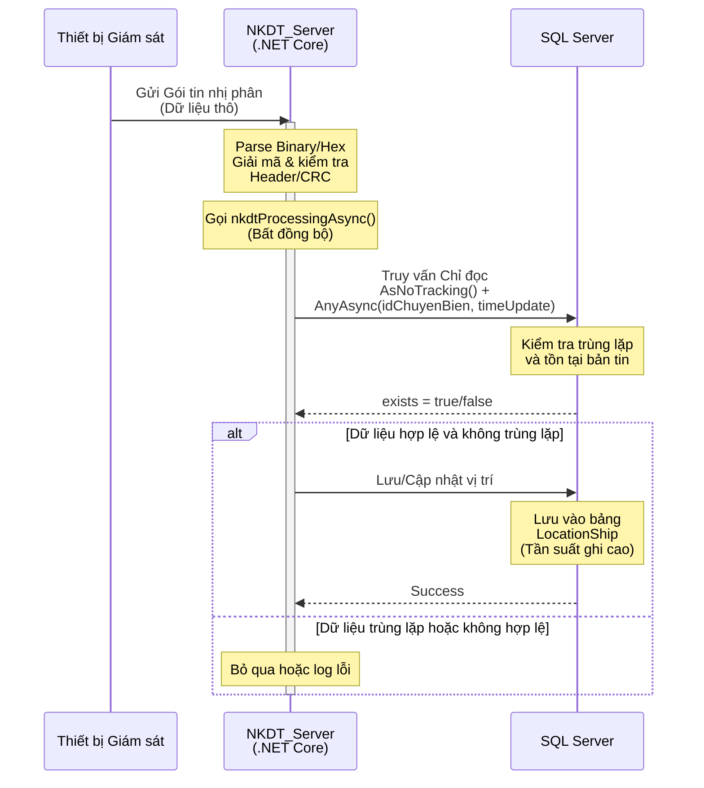
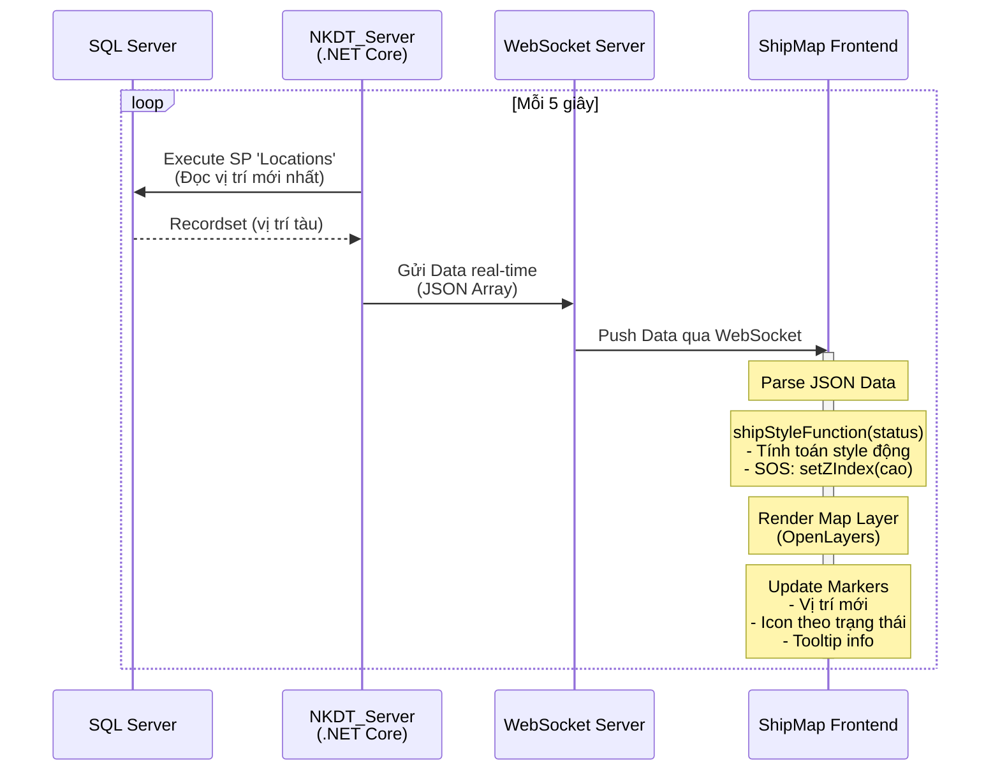
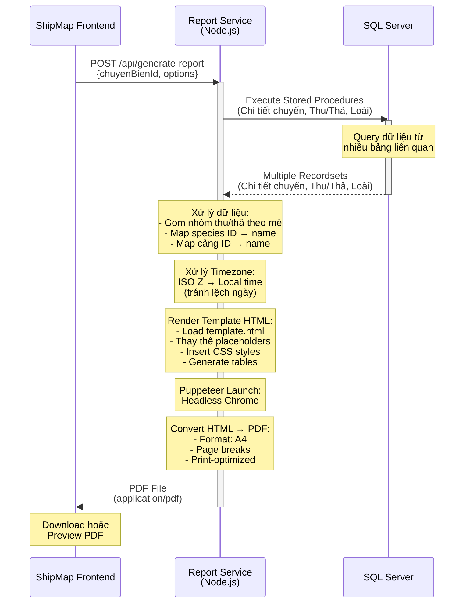

# Sơ đồ Tuần tự Hệ thống VMS (Vessel Monitoring System)

**Ngày tạo**: 2025-11-18  
**Phiên bản**: 1.0  

---

## Mục lục

1. [Giới thiệu](#giới-thiệu)
2. [Sơ đồ Tuần tự 1: Xử lý và Lưu Trữ Dữ liệu Vị trí](#sơ-đồ-tuần-tự-1-xử-lý-và-lưu-trữ-dữ-liệu-vị-trí)
3. [Sơ đồ Tuần tự 2: Hiển thị Vị trí Real-time trên Bản đồ](#sơ-đồ-tuần-tự-2-hiển-thị-vị-trí-real-time-trên-bản-đồ)
4. [Sơ đồ Tuần tự 3: Sinh Báo cáo Khai thác PDF](#sơ-đồ-tuần-tự-3-sinh-báo-cáo-khai-thác-pdf)
5. [Tổng kết](#tổng-kết)

---

## Giới thiệu

Tài liệu này mô tả ba luồng tương tác chính của Hệ thống VMS (Vessel Monitoring System) thông qua các sơ đồ tuần tự (Sequence Diagrams). Các sơ đồ này tập trung vào thứ tự và sự tương tác giữa các thành phần phần mềm và tầng kiến trúc của hệ thống.

### Mục tiêu
- Minh họa rõ ràng luồng dữ liệu giữa các thành phần
- Giúp đội ngũ phát triển hiểu về kiến trúc hệ thống
- Cung cấp tài liệu tham khảo cho việc bảo trì và mở rộng

### Kiến trúc tổng quan
Hệ thống VMS bao gồm các thành phần chính:
- **Thiết bị Giám sát**: Các thiết bị trên tàu gửi dữ liệu vị trí
- **NKDT_Server (.NET Core)**: Server xử lý dữ liệu từ thiết bị
- **SQL Server**: Cơ sở dữ liệu lưu trữ thông tin
- **Report Service (Node.js)**: Dịch vụ sinh báo cáo PDF
- **WebSocket Server**: Truyền dữ liệu real-time
- **ShipMap Frontend**: Giao diện bản đồ hiển thị vị trí tàu

---

## Sơ đồ Tuần tự 1: Xử lý và Lưu Trữ Dữ liệu Vị trí

### Mô tả
Luồng này mô tả quá trình từ nhận gói tin thô từ thiết bị giám sát đến khi lưu vào Cơ sở Dữ liệu. Đây là luồng quan trọng nhất đối với hiệu suất cao của hệ thống, đảm bảo xử lý nhanh chóng và chính xác dữ liệu vị trí tàu.

### Các bước xử lý

1. **Thiết bị Giám sát → NKDT_Server (.NET Core)**
   - Gửi gói tin nhị phân (dữ liệu thô)
   - Giao thức: TCP/UDP với format nhị phân

2. **NKDT_Server (.NET Core)**
   - Thực hiện hàm `Parse Binary/Hex`
   - Giải mã và kiểm tra Header/CRC
   - Validate tính toàn vẹn của dữ liệu

3. **NKDT_Server (.NET Core)**
   - Gọi hàm `nkdtProcessingAsync()` bất đồng bộ
   - Xử lý không chặn thread chính

4. **NKDT_Server (.NET Core) → SQL Server**
   - Truy vấn chỉ đọc: `AsNoTracking() + AnyAsync(idChuyenBien, timeUpdate)`
   - Mục tiêu: Kiểm tra trùng lặp và tồn tại bản tin
   - Giảm tải cho DB bằng cách chỉ query metadata

5. **SQL Server → NKDT_Server (.NET Core)**
   - Trả về `exists = true/false`
   - Thời gian phản hồi < 50ms

6. **NKDT_Server (.NET Core) → SQL Server**
   - Thực hiện lưu/cập nhật vị trí
   - Insert hoặc Update tùy theo kết quả kiểm tra

7. **SQL Server**
   - Lưu vào bảng `LocationShip` (bảng có tần suất ghi cao)
   - Index được tối ưu cho insert nhanh

### Sơ đồ Tuần tự

### Đặc điểm kỹ thuật

- **Hiệu suất**: Xử lý > 1000 gói tin/giây
- **Bất đồng bộ**: Sử dụng async/await để tối ưu throughput
- **Kiểm tra trùng lặp**: Giảm tải DB bằng AsNoTracking()
- **Index**: Bảng LocationShip có index trên (idChuyenBien, timeUpdate)

---

## Sơ đồ Tuần tự 2: Hiển thị Vị trí Real-time trên Bản đồ

### Mô tả
Luồng này mô tả cách dữ liệu vị trí được đẩy ra giao diện người dùng để hiển thị trực quan trên bản đồ. Hệ thống sử dụng WebSocket để truyền dữ liệu real-time, đảm bảo người dùng luôn nhìn thấy vị trí tàu mới nhất.

### Các bước xử lý

1. **SQL Server → NKDT_Server (.NET Core)**
   - Đọc dữ liệu real-time (vị trí mới nhất)
   - Query định kỳ mỗi 5 giây
   - Stored Procedure: `Locations`

2. **NKDT_Server (.NET Core) → WebSocket**
   - Gửi dữ liệu real-time
   - Format: JSON array
   - Chỉ gửi dữ liệu có thay đổi

3. **WebSocket → ShipMap Frontend**
   - Truyền dữ liệu real-time đến trình duyệt
   - Kết nối persistent
   - Port: 8080 (mặc định)

4. **ShipMap Frontend**
   - Sử dụng `shipStyleFunction(status)` để tính toán style động
   - Đảm bảo marker SOS luôn hiển thị trên cùng (`setZIndex(cao)`)
   - Phân loại trạng thái: Hoạt động, Không hoạt động, SOS

5. **ShipMap Frontend**
   - Render Map layer sử dụng OpenLayers
   - Update marker position mượt mà
   - Hiển thị popup với thông tin chi tiết

### Sơ đồ Tuần tự

### Đặc điểm kỹ thuật

- **Tần suất cập nhật**: 5 giây/lần
- **WebSocket Port**: 8080
- **Map Library**: OpenLayers
- **Hiển thị**: 
  - Icon khác nhau theo trạng thái tàu
  - SOS có z-index cao nhất
  - Tooltip hiển thị thông tin chi tiết
- **Tối ưu**: Chỉ update marker khi có thay đổi

---

## Sơ đồ Tuần tự 3: Sinh Báo cáo Khai thác PDF

### Mô tả
Luồng này minh họa quy trình tạo báo cáo phức tạp, sử dụng dịch vụ chuyên dụng (Node.js). Báo cáo PDF được sinh từ template HTML với dữ liệu động lấy từ database, bao gồm thông tin chi tiết về chuyến khai thác, thu/thả lưới, và danh sách loài.

### Các bước xử lý

1. **ShipMap Frontend → Report Service (Node.js)**
   - Gửi API request yêu cầu báo cáo
   - Method: POST
   - Endpoint: `/api/generate-report`
   - Payload: `{ chuyenBienId, options }`

2. **Report Service (Node.js) → SQL Server**
   - Gọi Stored Procedures (SPs)
   - Mục tiêu: Lấy nhiều recordsets
     - Chi tiết chuyến biển
     - Dữ liệu thu/thả lưới
     - Danh sách loài khai thác

3. **SQL Server → Report Service (Node.js)**
   - Trả về dữ liệu báo cáo (nhiều recordsets)
   - Format: Multiple result sets

4. **Report Service (Node.js) - Xử lý dữ liệu**
   - Gom nhóm dữ liệu con (thu/thả theo mẻ)
   - Xử lý Timezone: chuyển đổi từ ISO Z sang cục bộ
   - Map species ID sang tên (sử dụng `species.json`)
   - Map cảng ID sang tên (sử dụng `cang.json`)

5. **Report Service (Node.js) - Render Template**
   - Load template HTML từ file
   - Chèn dữ liệu vào template
   - Thay thế các placeholder
   - Format bảng động (thu/thả, loài)

6. **Report Service (Node.js) - Puppeteer**
   - Thực hiện Puppeteer/Headless Chrome
   - Mục tiêu: Chuyển đổi HTML → PDF
   - Cấu hình: A4, margins, page breaks

7. **Report Service (Node.js) → ShipMap Frontend**
   - Trả về PDF File
   - Content-Type: `application/pdf`
   - Download tự động hoặc preview

### Sơ đồ Tuần tự

### Đặc điểm kỹ thuật

- **Template**: HTML + CSS
- **Data mapping**: 
  - `species.json`: ID → Tên loài
  - `cang.json`: ID → Tên cảng
- **Timezone**: Chuyển đổi từ UTC sang GMT+7
- **PDF Engine**: Puppeteer (Headless Chrome)
- **Page format**: A4
- **Bảng động**: 
  - Bảng thu/thả lưới
  - Bảng loài khai thác
  - Bảng truyền tải
- **Tối ưu**: 
  - Gom nhóm queries bằng TVP
  - Cache species/cảng mappings

---

## Tổng kết

### Kiến trúc tổng quan

Hệ thống VMS được thiết kế với kiến trúc phân tầng rõ ràng:

1. **Tầng Thu thập dữ liệu**: 
   - Thiết bị giám sát → NKDT_Server
   - Xử lý binary protocol, validate CRC

2. **Tầng Lưu trữ**: 
   - SQL Server với stored procedures
   - Index tối ưu cho high-write workload

3. **Tầng Real-time**: 
   - WebSocket server
   - Push updates mỗi 5 giây

4. **Tầng Hiển thị**: 
   - OpenLayers map
   - Dynamic styling theo trạng thái

5. **Tầng Báo cáo**: 
   - Node.js service
   - HTML to PDF conversion

### Các điểm mạnh

- **Hiệu suất cao**: Xử lý bất đồng bộ, AsNoTracking() queries
- **Real-time**: WebSocket cho cập nhật tức thời
- **Scalable**: Kiến trúc phân tầng dễ mở rộng
- **Flexible reporting**: Template-based PDF generation

### Khuyến nghị

1. **Giám sát**: Implement logging và monitoring cho các luồng quan trọng
2. **Caching**: Cache species/cảng data để giảm DB load
3. **Error handling**: Xử lý các trường hợp lỗi network, timeout
4. **Load balancing**: Cân nhắc multiple instances cho high traffic

---

**Tài liệu này phục vụ mục đích kỹ thuật nội bộ và có thể được cập nhật khi hệ thống phát triển.**
