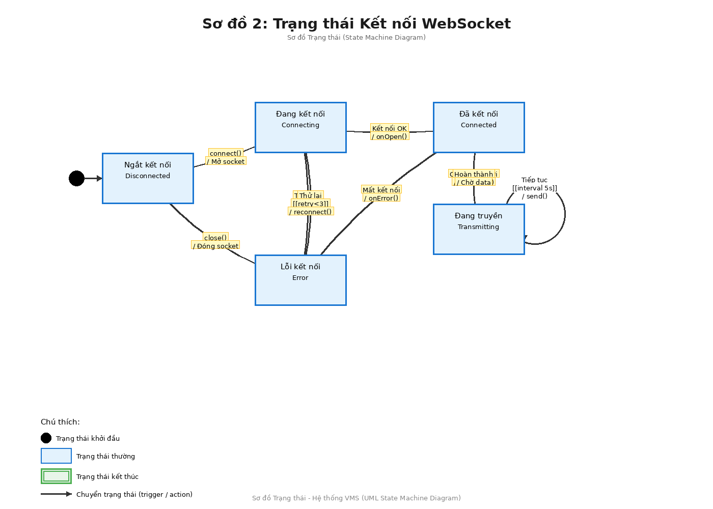
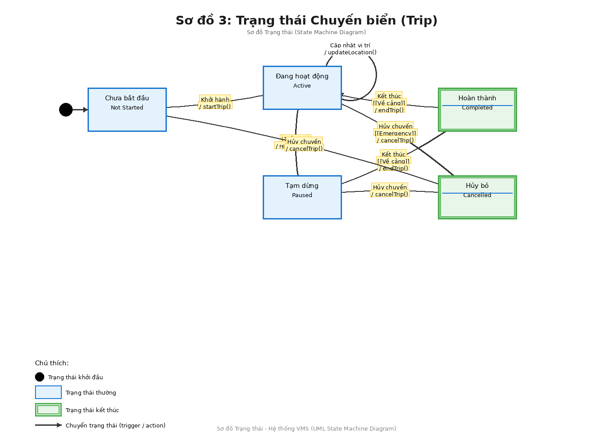

# Sơ đồ Trạng thái Hệ thống VMS (Vessel Monitoring System)

**Ngày tạo**: 2025-11-18  
**Phiên bản**: 1.0  
**Loại sơ đồ**: State Machine Diagram (Statechart Diagram)

---

## Mục lục

1. [Giới thiệu](#giới-thiệu)
2. [Sơ đồ Trạng thái 1: Xử lý Dữ liệu Vị trí](#sơ-đồ-trạng-thái-1-xử-lý-dữ-liệu-vị-trí)
3. [Sơ đồ Trạng thái 2: Kết nối WebSocket](#sơ-đồ-trạng-thái-2-kết-nối-websocket)
4. [Sơ đồ Trạng thái 3: Vòng đời Chuyến biển](#sơ-đồ-trạng-thái-3-vòng-đời-chuyến-biển)
5. [Quy ước và Ký hiệu](#quy-ước-và-ký-hiệu)
6. [Tổng kết](#tổng-kết)

---

## Giới thiệu

Tài liệu này mô tả các trạng thái và chuyển đổi trạng thái của các thành phần chính trong Hệ thống VMS thông qua **Sơ đồ Trạng thái (State Machine Diagram)**. Các sơ đồ này giúp hiểu rõ vòng đời và hành vi của các đối tượng trong hệ thống.

### Sơ đồ Trạng thái là gì?

Sơ đồ Trạng thái (State Machine Diagram) là một loại sơ đồ UML mô tả:
- **Các trạng thái** mà một đối tượng có thể có
- **Các sự kiện** (events/triggers) gây ra chuyển đổi trạng thái
- **Các hành động** (actions) được thực hiện khi chuyển đổi
- **Các điều kiện bảo vệ** (guards) quyết định chuyển đổi có xảy ra hay không

### Khi nào sử dụng Sơ đồ Trạng thái?

- Khi đối tượng có **hành vi phụ thuộc vào trạng thái** hiện tại
- Khi cần mô tả **vòng đời** của một entity
- Khi có **luồng xử lý phức tạp** với nhiều điều kiện
- Khi cần hiểu **các tình huống lỗi** và cách xử lý

### Các thành phần chính

Hệ thống VMS có ba state machines quan trọng:
1. **Xử lý Dữ liệu Vị trí**: Vòng đời của một gói tin từ thiết bị
2. **Kết nối WebSocket**: Trạng thái kết nối real-time
3. **Chuyến biển (Trip)**: Vòng đời của một chuyến khai thác

---

## Sơ đồ Trạng thái 1: Xử lý Dữ liệu Vị trí

### Mô tả

Sơ đồ này mô tả vòng đời của một gói tin dữ liệu vị trí từ khi nhận từ thiết bị giám sát đến khi lưu vào database hoặc bị từ chối. Đây là luồng xử lý quan trọng nhất, xảy ra hàng nghìn lần mỗi giây.

### Các trạng thái

1. **Chờ nhận dữ liệu** (Idle State)
   - Trạng thái khởi đầu
   - Hệ thống sẵn sàng nhận gói tin mới
   - Listening trên TCP/UDP port

2. **Đang xử lý Parsing**
   - Parse gói tin nhị phân
   - Kiểm tra Header và CRC
   - Validate cấu trúc dữ liệu

3. **Kiểm tra trùng lặp**
   - Gọi AsNoTracking() + AnyAsync()
   - Query database để kiểm tra tồn tại
   - Giảm tải cho DB

4. **Đang lưu vào DB**
   - Insert hoặc Update vào LocationShip
   - Transaction processing
   - Xử lý concurrent writes

5. **Hoàn thành** (Final State)
   - Gói tin đã được xử lý thành công
   - Sẵn sàng nhận gói tin tiếp theo

6. **Lỗi / Bỏ qua**
   - Gói tin không hợp lệ hoặc lỗi DB
   - Log lỗi để phân tích
   - Quay lại trạng thái chờ

### Chuyển đổi trạng thái

| Từ trạng thái | Đến trạng thái | Trigger | Guard | Action |
|---------------|----------------|---------|-------|--------|
| Chờ nhận | Đang xử lý | Nhận gói tin | - | Parse Binary |
| Đang xử lý | Kiểm tra trùng lặp | Parse thành công | - | Gọi AnyAsync() |
| Đang xử lý | Lỗi | Parse thất bại | [CRC error] | Log lỗi |
| Kiểm tra | Đang lưu | Không trùng lặp | [exists=false] | Insert/Update |
| Kiểm tra | Hoàn thành | Trùng lặp | [exists=true] | Skip |
| Đang lưu | Hoàn thành | Lưu thành công | - | Success |
| Đang lưu | Lỗi | Lưu thất bại | [DB error] | Rollback |
| Hoàn thành | Chờ nhận | Sẵn sàng | - | Reset |
| Lỗi | Chờ nhận | Tiếp tục | - | Reset |

### Sơ đồ


### Xử lý lỗi

- **Parse Error**: CRC không khớp, format không đúng → Log và bỏ qua
- **DB Error**: Connection timeout, deadlock → Retry hoặc skip
- **Duplicate**: Gói tin đã tồn tại → Skip không lưu

### Metrics quan trọng

- **Success Rate**: % gói tin xử lý thành công
- **Parse Error Rate**: % gói tin parse lỗi
- **Average Processing Time**: Thời gian xử lý trung bình
- **DB Write Latency**: Độ trễ ghi database

---

## Sơ đồ Trạng thái 2: Kết nối WebSocket

### Mô tả

Sơ đồ này mô tả vòng đời của một kết nối WebSocket từ client (Frontend) đến server. WebSocket được sử dụng để truyền dữ liệu vị trí real-time từ server đến bản đồ.

### Các trạng thái

1. **Ngắt kết nối** (Disconnected)
   - Trạng thái khởi đầu
   - Chưa có kết nối
   - Client chưa kết nối hoặc đã đóng

2. **Đang kết nối** (Connecting)
   - Client đang thiết lập kết nối
   - WebSocket handshake
   - Timeout sau 30 giây

3. **Đã kết nối** (Connected)
   - Kết nối đã thiết lập thành công
   - Sẵn sàng truyền dữ liệu
   - Heartbeat monitoring

4. **Đang truyền** (Transmitting)
   - Đang gửi dữ liệu real-time
   - Gửi mỗi 5 giây
   - Active data transfer

5. **Lỗi kết nối** (Error)
   - Connection lost
   - Network error
   - Server error

### Chuyển đổi trạng thái

| Từ trạng thái | Đến trạng thái | Trigger | Guard | Action |
|---------------|----------------|---------|-------|--------|
| Ngắt kết nối | Đang kết nối | connect() | - | Mở socket |
| Đang kết nối | Đã kết nối | Kết nối OK | - | onOpen() |
| Đang kết nối | Lỗi | Timeout | [>30s] | onError() |
| Đã kết nối | Đang truyền | Có dữ liệu mới | - | send(data) |
| Đang truyền | Đang truyền | Tiếp tục | [interval 5s] | send() |
| Đang truyền | Đã kết nối | Hoàn thành | - | Chờ data |
| Đã kết nối | Lỗi | Mất kết nối | - | onError() |
| Lỗi | Ngắt kết nối | close() | - | Đóng socket |
| Lỗi | Đang kết nối | Thử lại | [retry<3] | reconnect() |

### Sơ đồ



### Cơ chế Retry

- **Max Retries**: 3 lần
- **Retry Delay**: Exponential backoff (1s, 2s, 4s)
- **Timeout**: 30 giây cho mỗi lần kết nối
- **Auto Reconnect**: Tự động kết nối lại khi mất kết nối

### Heartbeat

- **Interval**: 30 giây
- **Timeout**: 60 giây không nhận heartbeat → disconnect
- **Ping/Pong**: WebSocket ping/pong frames

---

## Sơ đồ Trạng thái 3: Vòng đời Chuyến biển

### Mô tả

Sơ đồ này mô tả vòng đời của một chuyến khai thác (Trip) từ lúc tạo mới đến khi hoàn thành hoặc hủy bỏ. Đây là business logic quan trọng của hệ thống VMS.

### Các trạng thái

1. **Chưa bắt đầu** (Not Started)
   - Trạng thái khởi đầu
   - Chuyến đã được tạo nhưng chưa khởi hành
   - Đang chuẩn bị

2. **Đang hoạt động** (Active)
   - Tàu đã khởi hành
   - Đang cập nhật vị trí liên tục
   - Đang khai thác

3. **Tạm dừng** (Paused)
   - Tàu tạm dừng hoạt động
   - Có thể do thời tiết, sửa chữa
   - Vẫn tracking vị trí

4. **Hoàn thành** (Completed) - Final State
   - Tàu đã về cảng
   - Chuyến kết thúc thành công
   - Dữ liệu đã được lưu đầy đủ

5. **Hủy bỏ** (Cancelled) - Final State
   - Chuyến bị hủy
   - Do lỗi, emergency, hoặc quyết định hủy
   - Dữ liệu vẫn được lưu

### Chuyển đổi trạng thái

| Từ trạng thái | Đến trạng thái | Trigger | Guard | Action |
|---------------|----------------|---------|-------|--------|
| Chưa bắt đầu | Đang hoạt động | Khởi hành | - | startTrip() |
| Đang hoạt động | Đang hoạt động | Cập nhật vị trí | - | updateLocation() |
| Đang hoạt động | Tạm dừng | Dừng tạm | - | pauseTrip() |
| Tạm dừng | Đang hoạt động | Tiếp tục | - | resumeTrip() |
| Đang hoạt động | Hoàn thành | Kết thúc | [Về cảng] | endTrip() |
| Tạm dừng | Hoàn thành | Kết thúc | [Về cảng] | endTrip() |
| Chưa bắt đầu | Hủy bỏ | Hủy chuyến | - | cancelTrip() |
| Đang hoạt động | Hủy bỏ | Hủy chuyến | [Emergency] | cancelTrip() |
| Tạm dừng | Hủy bỏ | Hủy chuyến | - | cancelTrip() |

### Sơ đồ



### Business Rules

- **Khởi hành**: Phải có thông tin tàu, thuyền trưởng, cảng xuất phát
- **Cập nhật vị trí**: Tự động mỗi khi nhận gói tin từ thiết bị
- **Tạm dừng**: Có thể tạm dừng nhiều lần trong một chuyến
- **Kết thúc**: Chỉ khi tàu về đến cảng đích
- **Hủy bỏ**: Có thể hủy ở bất kỳ trạng thái nào (trừ Completed/Cancelled)

### Dữ liệu lưu trữ

Mỗi chuyến biển lưu:
- **Thông tin chung**: ID, tên tàu, thuyền trưởng
- **Thời gian**: Khởi hành, kết thúc, tổng thời gian
- **Vị trí**: Track đường đi, điểm thu/thả lưới
- **Khai thác**: Loài, khối lượng, số lượng
- **Trạng thái**: Current state, lịch sử chuyển đổi

---

## Quy ước và Ký hiệu

### Ký hiệu UML State Machine

1. **Initial State** (●)
   - Vòng tròn đen đặc
   - Điểm bắt đầu của state machine
   - Mỗi diagram có đúng 1 initial state

2. **State** (Hình chữ nhật bo góc)
   - Màu xanh dương: Trạng thái thường
   - Chứa tên trạng thái
   - Có thể có internal activities

3. **Final State** (◎)
   - Vòng tròn kép
   - Màu xanh lá: Trạng thái kết thúc
   - Có thể có nhiều final states

4. **Transition** (Mũi tên)
   - Solid line với arrowhead
   - Label: `trigger [guard] / action`
   - Curved arrows cho clarity

5. **Self-Transition** (Loop)
   - Transition quay lại chính nó
   - Thường dùng cho internal processing

### Format của Transition Label

```
trigger [guard] / action
```

- **trigger**: Sự kiện gây ra chuyển đổi (bắt buộc)
- **[guard]**: Điều kiện để chuyển đổi xảy ra (optional)
- **/ action**: Hành động thực hiện khi chuyển đổi (optional)

### Ví dụ

```
Nhận gói tin / Parse Binary
```
- Trigger: "Nhận gói tin"
- Action: "Parse Binary"

```
Parse thất bại [CRC error] / Log lỗi
```
- Trigger: "Parse thất bại"
- Guard: "[CRC error]"
- Action: "Log lỗi"

---

## Tổng kết

### So sánh ba State Machines

| Đặc điểm | Location Processing | WebSocket Connection | Trip Lifecycle |
|----------|---------------------|---------------------|----------------|
| **Số trạng thái** | 6 | 5 | 5 |
| **Final states** | 1 | 0 (cycle) | 2 |
| **Complexity** | Cao | Trung bình | Trung bình |
| **Frequency** | Rất cao (1000s/s) | Trung bình | Thấp |
| **Error handling** | Phức tạp | Retry logic | Business rules |
| **Duration** | Milliseconds | Minutes-Hours | Hours-Days |

### Patterns nhận dạng

1. **Location Processing**: **Error Recovery Pattern**
   - Nhiều error states
   - Recovery paths back to idle
   - Focus on resilience

2. **WebSocket Connection**: **Connection Management Pattern**
   - Retry logic
   - Timeout handling
   - Reconnection strategy

3. **Trip Lifecycle**: **Business Process Pattern**
   - Clear start and end
   - Multiple final states
   - Business rules enforcement

### Khi nào sử dụng mỗi loại sơ đồ?

| Diagram Type | Use Case | Focus |
|--------------|----------|-------|
| **State Machine** | Behavior của một object | States & transitions |
| **Sequence** | Time ordering của messages | Temporal sequence |
| **Collaboration** | Object relationships | Structure & organization |

### Best Practices

1. **Keep states simple**: Mỗi state nên có ý nghĩa rõ ràng
2. **Name transitions clearly**: Trigger phải dễ hiểu
3. **Guard conditions**: Sử dụng [] để điều kiện rõ ràng
4. **Error states**: Luôn có path xử lý lỗi
5. **Document actions**: Ghi rõ action khi chuyển đổi

### Áp dụng trong Code

State machines có thể implement bằng:

1. **Simple if-else**: Cho state machine đơn giản
2. **State Pattern**: Design pattern OOP
3. **State Machine Libraries**: Stateless, XState, etc.
4. **Workflow Engines**: Cho business processes phức tạp

---

## Liên kết với các Sơ đồ khác

Tài liệu này bổ sung cho:
- [Sơ đồ Tuần tự Hệ thống VMS](VMS-Sequence-Diagrams.md) - Time-based interactions
- [Sơ đồ Tương tác Hệ thống VMS](VMS-Collaboration-Diagrams.md) - Structural relationships

Cùng nhau, ba loại sơ đồ cung cấp **góc nhìn toàn diện** về hệ thống VMS:
- **Sequence**: WHEN things happen (timing)
- **Collaboration**: HOW objects collaborate (structure)
- **State Machine**: WHAT states objects go through (behavior)

---

**Tài liệu này phục vụ mục đích kỹ thuật nội bộ và có thể được cập nhật khi hệ thống phát triển.**
